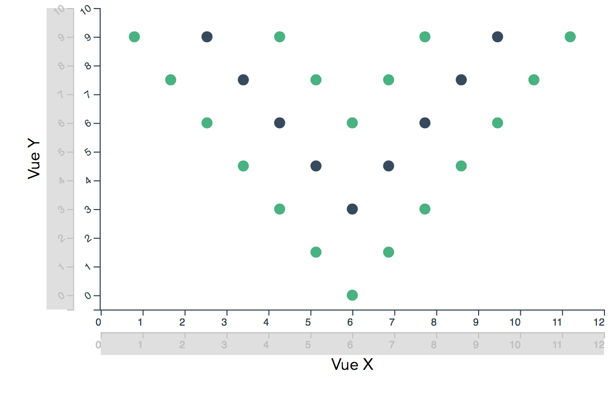

[](https://travis-ci.org/keller-mark/vue-declarative-plots)
[](https://coveralls.io/github/keller-mark/vue-declarative-plots?branch=master)
[](https://www.npmjs.com/package/vue-declarative-plots)

# vue-declarative-plots

:warning: vue-declarative-plots is changing its name to **vueplotlib** in [version 2.0](https://github.com/keller-mark/vueplotlib/tree/v2) :warning:



This repository will serve as a place for reusable Vue plot components (built with D3).
These components were developed for use in [iMuSE](https://github.com/lrgr/mutation-signature-explorer).

- [Demo](https://keller-mark.github.io/vue-declarative-plots/)
- [Documentation](https://keller-mark.github.io/vue-declarative-plots/docs/)


### Installation
```bash
yarn add vue-declarative-plots
```

### Example Usage
Please see the [vue-declarative-plots-examples](https://github.com/keller-mark/vue-declarative-plots-examples) repository for minimal examples of usage.


### Plot Components
- BarPlot :white_check_mark:
- StackedBarPlot :white_check_mark:
- ScatterPlot :white_check_mark:
- TrackPlot :white_check_mark:
- MultiTrackPlot :white_check_mark:
- BoxPlot :white_check_mark:
- MultiBoxPlot :white_check_mark:
- HierarchicalMultiTrackPlot :white_check_mark:

### Stratified Plot Components
- StratifiedBoxPlot :white_check_mark:
- StratifiedScatterPlot :white_check_mark:
- StratifiedSinaPlot :white_check_mark:
- StratifiedKaplanMeierPlot :white_check_mark:

#### Genome Plot Components
- GenomeScatterPlot :white_check_mark:
- GenomeStackedBarPlot :white_check_mark:
- GenomeTrackPlot :white_check_mark:
- GenomeMultiTrackPlot :white_check_mark:

### Axis Components
- Axis :white_check_mark:
- GenomeAxis :white_check_mark:
- DendrogramAxis :white_check_mark:

### Legend Components
- CategoricalLegend :white_check_mark:
- ContinuousLegend :white_check_mark:

### Other Components
- PlotContainer :white_check_mark:
- SortOptions :white_check_mark:

### Future Plans for Components
- GenomeBarPlot
- GroupedBarPlot
- ViolinPlot
- SinaPlot
- BeeswarmPlot
- JitterPlot
- HorizontalBarPlot
- HorizontalStackedBarPlot
- HorizontalBoxPlot
- HorizontalMultiBoxPlot
- LinePlot
- KaryotypePlot
- GenomeGenePlot


### Development

Install dependencies:
```bash
yarn
```

Serve for development at [http://localhost:8080](http://localhost:8080):
```bash
yarn run serve
```

Build for production (generates `/dist` and `/examples`):
```bash
yarn run build
```

Run tests with [jest](https://jestjs.io/):
```bash
yarn run test
```

Compile documentation with [documentationjs](https://documentation.js.org/):
```bash
yarn run docs
```


### Goals: 
- [x] props should declare visual encodings of data
    - example: the StackedBarPlot component will accept the following props:
        ```js
        x="sample_id"
        y="exposure"
        c="signature" // color
        ```
- [x] props should declare where to find the data
    - data will never be passed directly to a plot - instead it will be globally accessible by a key
    - for now, assume data is stored in a global JSON object with `<key>: <data>` mappings
    - example: for a dataset with key `exposures_data`, the following prop would specify to a plot component that this dataset should be used:
        ```js
        data="exposures_data"
        ```
- [x] props should declare where to find the scales
    - [x] scales will be ES6 classes with different APIs depending on whether categorical, continuous, etc...
    - [x] scales will always expose a domain
    - [x] scales will always expose a domain-var-to-color function
    - [x] the color scale (or even individual colors) should also be able to be changed programmatically
    - [x] scales will always expose a domain-var-to-human-readable-text function
    - [x] categorical scales will always expose a sort function that takes in a specification of the data that will define the ordering
    - [x] scales will always expose a filter function (and a corresponding filter-reset function)
        - if categorical, this will accept an array of new values
        - if continuous, this will accept a `[min, max]` array
        - if binary, this will accept a boolean value
    - scales should contain all of the information necessary to draw a legend
    - scales will never be passed directly to a plot - instead they will be globally accessible by a key
    - for now, assume scales are stored in a global JSON object with `<variable>: <scale>` mappings
    - example: for a variable `sample_id`, the following prop would specify to a plot component that this scale object should be used for the x axis:
        ```js
        x="sample_id"
        ```
- [x] plots should assume which type of scale is on which axis
    - for example, a bar plot (with vertical bars) would assume a continuous y scale and a categorical x
- [x] events should alert plots when a scale has been mutated
    - these alerts should specify which scale has been updated using a key
    - plot components should listen for these updates and re-draw if necessary
    - scales may be mutated upon filter or zoom
- [x] data should be immutable
    - even small variations of data sets should be stored in a separate `DataContainer` instance
    - however, plots may need to subscribe to data updates for asynchronous loading reasons
- [x] plots should NOT draw their own axes
    - axes should be independent of plots
    - axes should be contained in their own components
- [x] axes should accept props specifying which scale to use, and where to draw
    - example:
        ```js
        variable="sample_id"
        side="bottom"
        ```
- [x] axes should be brush-able
    - but also should have the option to disable brushing
    - brushing along an axis should trigger a zoom event
    - axes, if their corresponding scale has been "zoomed", should display a "zoomed out"/full view beside the "zoomed-in" view in order to show [context](https://bl.ocks.org/mbostock/34f08d5e11952a80609169b7917d4172)
    - categorical axes should [snap](https://bl.ocks.org/mbostock/6232537)
- [x] plots and axes should accept `width` and `height` props
    - container components should be responsible for keeping plot and axis props in sync if they are dynamic
    - example:
        ```js
        :pWidth="windowWidth"
        :pHeight="300"
        ```
- [x] plots should accept margin props
    - container components should be responsible for keeping margin props in sync if they are dynamic
    - example:
        ```js
        :pMarginTop="10"
        :pMarginLeft="50"
        :pMarginRight="20"
        :pMarginBottom="0"
        ```
- [x] plots should emit click events, specifying variables in a predefined order to a prop-supplied callback
    - example:
    ```js
    :clickHandler="chooseSample" // will be called with chooseSample(x, y, c)
    ```
- [x] plots should have tooltips
    - tooltips should obtain human-readable variable names from the appropriate scale
- [x] plots should dispatch applicable hover events
    - dispatching should be done through the scale
    - example:
        - hovering on a section of a bar on a stacked bar plot would cause dispatches for (at least) the `x` and `color` variables
- [x] the internals of the drawing of the plots should be abstracted away as much as possible
    - details of SVG, canvas, etc. implementation should be contained
- [x] all *meaningful* interactions will be stored in a history stack
    - meaningful interactions: scale filter/zoom/sort
    - will allow backward(undo)/forward(redo) operations
    - will allow "replaying" of the user's interactions
    - will allow sharing of a user session, so that others may replay or step through the interactions
    - but this should also be optional, for example if the user chooses not to supply the stack to a plot via prop
- [x] because of the emphasis of linked scales across datasets, for now this implies that legends are NOT "attached" to plots
    - rather, legends should be contained in a separate container component that is fixed on the screen
        - this container should house all of the legends for all of the plots, then based on highlighting, scroll to the specified inner legend
            - for example, through a `ScrollingLegendContainer` component
        - could instead prioritize which legends are showing in the container based on what plots are currently visible on the screen
            - for example, through a `PriorityLegendContainer` component
    - this will allow legend styles to be fixed no matter the height (font sizes, listing heights/widths, etc)

    - but the great thing is that because everything is decoupled, in the future this assumption could easily be relaxed through creation of components that act how the axes currently work (fill the space on one side of the plot through the `pMargin***` prop and the `side` prop, then lay out based on available space)
        - for example, through a set of `AttachedLegend` components 


<br><br>
This was inspired by the following projects:
- https://altair-viz.github.io/
- https://vega.github.io/vega-lite/
